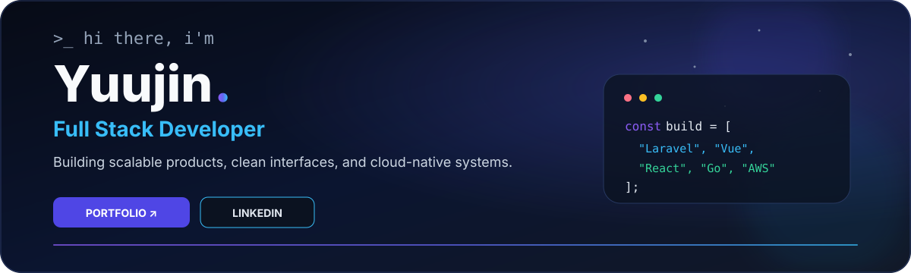

<div align="center">



<br/>

<a href="https://git.io/typing-svg">
  
</a>

<p>
  <a href="https://portfolio-website-silk-eta.vercel.app/">
    
  </a>
  <a href="https://www.linkedin.com/in/nikola-limpet-64a68227a/">
    
  </a>
  <a href="https://github.com/Nikola-Limpet?tab=repositories">
    
  </a>
</p>


</div>

---

## 👋 About Me

```ts
const yuujin = {
  role: "Full Stack Developer",
  location: "Phnom Penh, Cambodia",
  focus: "Scalable full-stack & cloud-native products",
  frontend: ["React", "Next.js", "Vue.js", "TypeScript"],
  backend: ["Laravel", "Go", "Node.js", "Express", "Flask"],
  cloud: ["AWS", "Cloudflare", "Railway"],
  values: ["Clean Code", "Great UX", "Reliable Systems"],
  currentlyLearning: ["Distributed Systems", "Advanced Cloud Patterns"],
  funFact: "Coffee ☕ → Code 💻 → Deploy 🚀 → Repeat 🔁"
};
```

<table>
<tr>
<td width="50%" valign="top">

### ⚡ Right now

- 🔭 Building **cloud-native full-stack applications**
- ☁️ **2× AWS Certified**
- 🌱 Exploring **distributed systems & cloud architecture**
- 💬 Ask me about **React, Vue.js, Laravel, Go, TanStack, AWS**
- 🤝 Open to interesting products and collaborations

</td>
<td width="50%" valign="top">

### 🧭 What I care about

- Clean, maintainable architecture
- Fast and thoughtful user experiences
- Practical engineering over unnecessary complexity
- Systems that are easy to operate and scale
- Constant learning and shipping

</td>
</tr>
</table>

---

## 🧰 Tech Stack

<div align="center">

### Frontend


<br/>


### Backend


### Databases & ORMs


<br/>


### Cloud & Infrastructure


<br/>


</div>

---

## 🏅 AWS Certifications

<div align="center">

<a href="https://www.credly.com/badges/b74b8d00-f95a-401d-8225-1ea29ae2a6a2/linked_in?t=swqtka">
  
</a>
&nbsp;&nbsp;&nbsp;&nbsp;
<a href="https://www.credly.com/badges/4d0c1415-9e2f-41ef-8f8b-50bf013d227b/linked_in">
  
</a>

<br/>

**Solutions Architect – Associate** &nbsp; • &nbsp; **Cloud Practitioner**

</div>

---

## 📊 GitHub Snapshot

<div align="center">


<br/>


</div>

---

## 📈 Contribution Activity

<div align="center">


</div>

---

## 🐍 Contribution Snake

<div align="center">

<picture>
  <source media="(prefers-color-scheme: dark)" srcset="https://raw.githubusercontent.com/Nikola-Limpet/Nikola-Limpet/output/github-contribution-grid-snake-dark.svg" />
  <source media="(prefers-color-scheme: light)" srcset="https://raw.githubusercontent.com/Nikola-Limpet/Nikola-Limpet/output/github-contribution-grid-snake.svg" />
  
</picture>

</div>

---

<div align="center">

### 💭 Words I Like

> **“Before software can be reusable, it first has to be usable.”**  
> — Ralph Johnson

<br/>

### 🤝 Let's Build Something Great

I'm always open to interesting conversations, ambitious products, and collaboration opportunities.

<a href="https://portfolio-website-silk-eta.vercel.app/">
  
</a>
<a href="https://www.linkedin.com/in/nikola-limpet-64a68227a/">
  
</a>

<br/><br/>

<sub>Code • Learn • Build • Deploy • Repeat</sub>

</div>
