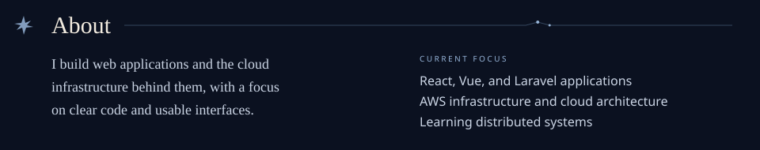
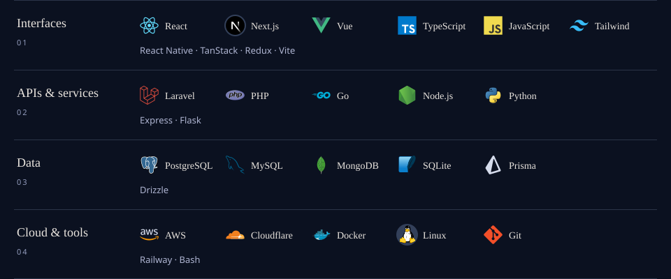

<picture>
  <source media="(max-width: 600px)" srcset="./assets/observatory-hero-mobile.gif" />
  
</picture>

[Portfolio](https://portfolio-website-silk-eta.vercel.app/) &nbsp; / &nbsp; [LinkedIn](https://www.linkedin.com/in/nikola-limpet-64a68227a/) &nbsp; / &nbsp; [Projects](https://github.com/Nikola-Limpet?tab=repositories)

<picture>
  <source media="(max-width: 600px)" srcset="./assets/observatory-about-mobile.svg" />
  
</picture>

<h2><picture>
  <source media="(max-width: 600px)" srcset="./assets/observatory-heading-toolkit-mobile.svg" />
  
</picture></h2>

<picture>
  <source media="(max-width: 600px)" srcset="./assets/toolkit-atlas-mobile.svg" />
  
</picture>

<h2><picture>
  <source media="(max-width: 600px)" srcset="./assets/observatory-heading-certifications-mobile.svg" />
  
</picture></h2>

  
  &nbsp;&nbsp;&nbsp;&nbsp;
  

  <a href="https://www.credly.com/badges/b74b8d00-f95a-401d-8225-1ea29ae2a6a2/linked_in?t=swqtka">Solutions Architect Associate</a> · <a href="https://www.credly.com/badges/4d0c1415-9e2f-41ef-8f8b-50bf013d227b/linked_in">Cloud Practitioner</a>

<h2><picture>
  <source media="(max-width: 600px)" srcset="./assets/observatory-heading-activity-mobile.svg" />
  
</picture></h2>

  

  

<a href="https://www.linkedin.com/in/nikola-limpet-64a68227a/">
  <picture>
    <source media="(max-width: 600px)" srcset="./assets/observatory-footer-mobile.webp" />
    
  </picture>
</a>
