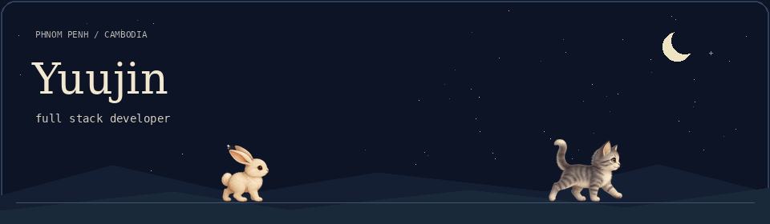
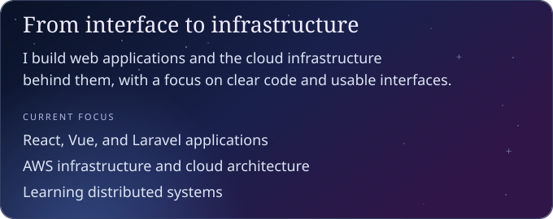
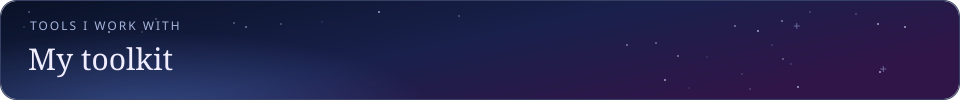
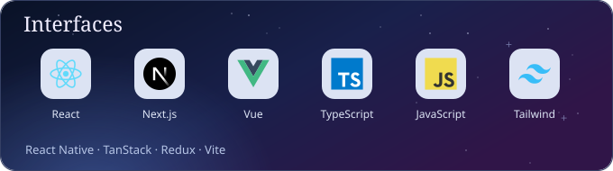
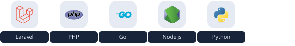
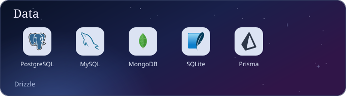
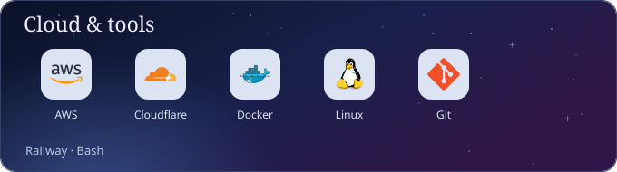
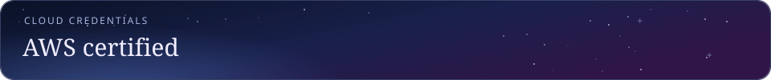
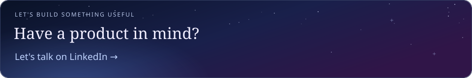

# Hey, I'm Yuujin.

**Full stack developer · Phnom Penh, Cambodia**

I build web applications and the cloud infrastructure behind them.

[Portfolio](https://portfolio-website-silk-eta.vercel.app/) &nbsp; / &nbsp; [LinkedIn](https://www.linkedin.com/in/nikola-limpet-64a68227a/) &nbsp; / &nbsp; [Projects](https://github.com/Nikola-Limpet?tab=repositories)

 

  <picture>
  <source media="(max-width: 600px)" srcset="./assets/night-about-mobile.svg" />
  
</picture>

<a href="https://github.com/Nikola-Limpet?tab=repositories">Browse my repositories →</a>

<h2><picture>
  <source media="(max-width: 600px)" srcset="./assets/night-section-toolkit-mobile.svg" />
  
</picture></h2>

  <picture>
  <source media="(max-width: 600px)" srcset="./assets/toolkit-frontend-mobile.svg" />
  
</picture>

  <picture>
  <source media="(max-width: 600px)" srcset="./assets/toolkit-backend-mobile.svg" />
  
</picture>

  <picture>
  <source media="(max-width: 600px)" srcset="./assets/toolkit-data-mobile.svg" />
  
</picture>

  <picture>
  <source media="(max-width: 600px)" srcset="./assets/toolkit-cloud-mobile.svg" />
  
</picture>

<h2><picture>
  <source media="(max-width: 600px)" srcset="./assets/night-section-certifications-mobile.svg" />
  
</picture></h2>

 &nbsp;&nbsp; 

[Solutions Architect Associate](https://www.credly.com/badges/b74b8d00-f95a-401d-8225-1ea29ae2a6a2/linked_in?t=swqtka) &nbsp; · &nbsp; [Cloud Practitioner](https://www.credly.com/badges/4d0c1415-9e2f-41ef-8f8b-50bf013d227b/linked_in)

<h2><picture>
  <source media="(max-width: 600px)" srcset="./assets/night-section-activity-mobile.svg" />
  
</picture></h2>

 

<a href="https://www.linkedin.com/in/nikola-limpet-64a68227a/">
  <picture>
  <source media="(max-width: 600px)" srcset="./assets/night-footer-mobile.svg" />
  
</picture>
</a>

