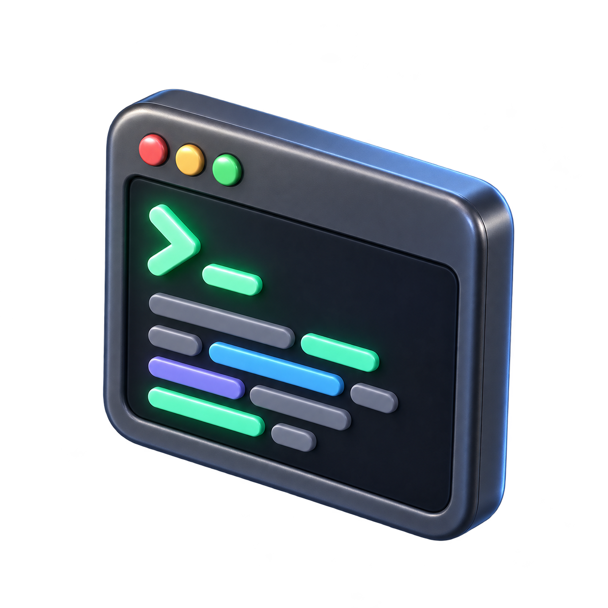

# Profile artwork

Generated with the built-in image generation tool. The GIF adds a gentle vertical float to the terminal artwork; it is a 2D animation of a 3D-style illustration, not an interactive 3D model.

| File | Use |
| :--- | :--- |
| `workstation-3d.webp` | Optimized README banner |
| `workstation-3d.png` | Original wide artwork |
| `terminal-3d.png` | Transparent terminal illustration |
| `terminal-float.gif` | Four-second loop, 320 × 320, 20 fps |
| `hero.webp` | Previous profile banner, retained for reuse |

## Still version

Use `terminal-3d.png` instead of `terminal-float.gif` anywhere you prefer no motion.



## Rebuild the animation

With FFmpeg installed, run `bash scripts/render-terminal-loop.sh` from the repository root. The script encodes the transparent source against GitHub's dark background, using 80 frames with no duplicate endpoint.

## Generation prompts

### Terminal

```text
Use case: stylized-concept
Asset type: reusable developer profile README illustration, transparent PNG
Primary request: a polished 3D miniature terminal window, floating at a slight isometric angle, with a chunky rounded frame and a few raised code-line bars inside. One clear terminal prompt glyph >_ and abstract short lines, no other readable text. Tactile satin materials, restrained luminous screen, believable soft reflections and ambient occlusion. Modern collectible object, carefully crafted geometry, strong silhouette at small display sizes.
Composition: single isolated object centered with generous transparent margins, fully visible, square canvas.
Lighting: soft studio key light and subtle rim lighting.
Constraints: genuinely transparent background, no floor plane, no watermark, no logos, no additional objects.
```

### Workstation

```text
Use case: stylized-concept
Asset type: reusable developer GitHub profile README wide hero artwork
Primary request: a beautifully crafted 3D miniature developer workstation, a floating rounded terminal display with mint green prompt >_, a compact mechanical keyboard, and a small stack of rounded server modules. Dark graphite satin metal and glass, subtle mint and ice-blue light. Cohesive sculptural objects with realistic bevels, elegant product rendering.
Scene: seamless very dark charcoal studio background.
Composition: cinematic panoramic banner, approximately 3:1 aspect ratio, entire workstation arranged centrally with generous breathing room all around; no cropped objects. A simple composition readable at README width.
Lighting: soft studio light, delicate reflections, restrained screen glow, crisp detailed materials.
Constraints: no titles, no logos, no watermark, no people, no illegible paragraphs, no extra decorative objects. Only prompt glyph on screen and a few abstract code bars.
```

